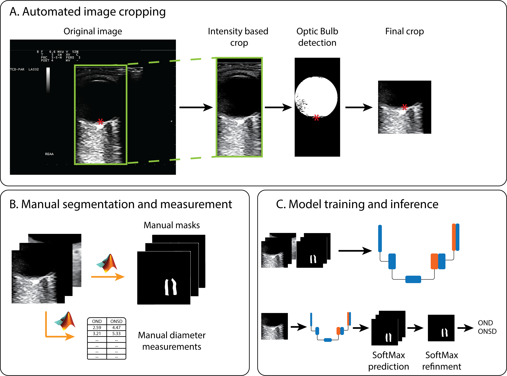

## Development of a Deep Learning-based system for Optic Nerve characterization in Transorbital Ultrasound Images on a multicenter dataset  

Official repository for the reproduction of the results presented in the article (<a href="https://doi.org/10.1016/j.ultrasmedbio.2023.05.011">Paper</a>). A smaller version of this work was presented at IUS 2021 (<a href="https://ieeexplore.ieee.org/document/9593827">IUS 2021</a>). Data, checkpoints of the trained models, and results have been shared using the Mendeley platform and are available at (<a href="https://data.mendeley.com/datasets/kw8gvp8m8x">Dataset</a>).

Development and training of the DL model have been coded using the awesome <a href="https://github.com/qubvel/segmentation_models.pytorch">Segmentation Models Pytorch</a> library.

## Optic Nerve segmentation
</img>

- Step 1 : Crop the original image to extract the 256x256 patches with the optic nerve.

```python
code: ./MATLAB/CROP/autoCrop.m 
data: ./DATA/IMAGES   
```

- Step 2 : Train a network to perform segmentation of the optic nerve sheaths or test a trained one.

```python
code: ./PYTHON/main.py
images: ./DATA/IMAGES_256 
labels: ./DATA/LABELS_256
```

- Step 3 : Post-process results and make segmentation maps

```python
code:  ./MATLAB/POST-PROCESSING/PostProcess.m 
data:  ./{checkpoint_folder}/Test_output
```

## Optic Nerve Diameter and Optic Nerve Sheaths Diameter measurements

```python
code:  ./MATLAB/DIAM_MEASUREMENTS/computeDiameters.m 
data:  ./{results_folder}/PREDICTIONS
```
